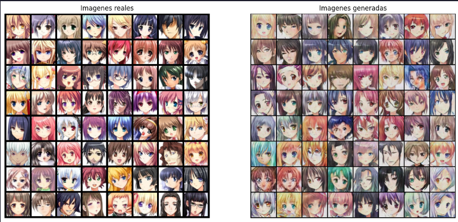

# 🌟 Discord Profile Picture Generator 🌟

## 🙋‍♂️ Integrantes

- Pedro Pablo Arriola Jimenez (20188)
- Marco Pablo Orozco Saravia (20857)
- Santiago Taracena Puga (20017)

## 📝 Descripción del Proyecto

El "Discord Profile Picture Generator" es un proyecto que utiliza PyTorch y la tecnología de las Redes Antagónicas Generativas (GANs) para generar imágenes de perfil de personajes de anime únicas y personalizadas. Creado específicamente para los entusiastas del anime que buscan personalizar sus avatares en Discord o en cualquier otra plataforma de redes sociales.

## 🚀 Partes del Proyecto

### 1️⃣ Importación de Librerías

Se importan todas las librerías necesarias, destacando el uso de PyTorch para la implementación de la red GAN.

### 2️⃣ Carga del Dataset

Se carga un conjunto de datos extenso y diverso de imágenes de anime para entrenar la red GAN, asegurando así que las imágenes generadas sean variadas y únicas.

Fuente del Dataset: [Anime Face Dataset](https://www.kaggle.com/datasets/splcher/animefacedataset)

### 3️⃣ Implementación de Red GAN

Se implementa una red GAN robusta y eficiente, utilizando PyTorch para garantizar la generación de imágenes de alta calidad.

### 4️⃣ Entrenamiento del Modelo

El modelo se entrena exhaustivamente utilizando el conjunto de datos de imágenes de anime, optimizando continuamente su rendimiento para mejorar la calidad de las imágenes generadas.

### 5️⃣ Generación de Imágenes

Una vez entrenado el modelo, se utiliza para generar imágenes de perfil de anime únicas y personalizadas.

### 6️⃣ Exportación del Modelo

Finalmente, el modelo entrenado se exporta para su uso futuro, permitiendo la generación continua de nuevas imágenes de perfil para Discord.

## 📦 Cómo Usar

Simplemente carga el modelo exportado en tu entorno PyTorch y úsalo para generar nuevas imágenes de perfil de anime en cualquier momento. ¡Es así de fácil!

